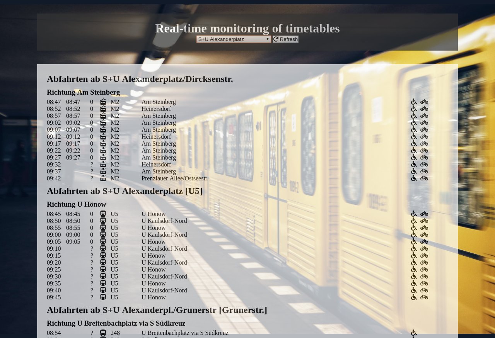

# bvg-test

This page was created by Stefan Klinkusch using vanilla JavaScript.
It features
- a dropdown menu to choose the desired station
- a refresh button to fetch current data for the station chosen the last
- a list of departures, sorted by bus stop (for close and neighboring stops), line, and direction
- for every departure (if data is present):
  - the scheduled time, as stated in the timetable
  - the real time when the departure is expected
  - the delay in minutes ("?" for unknown status, "X" for cancelled departures)
  - an icon showing the mean of transport
  - the line or train number
  - the destination
  - a wheelchair icon ♿ for barrier-free transportation means
  - a bicycle icon 🚲 if bicycle transport is permitted
  - a triangular sign with an exclamation mark if additional information for this departure is present (such as detours)
  - a cross sign ❌ if status information for this departure is present (such as cancellations or additional service)
  - the additional information is shown as a tooltip on the respective sign
- a footer with additional information and links

## Screenshot

